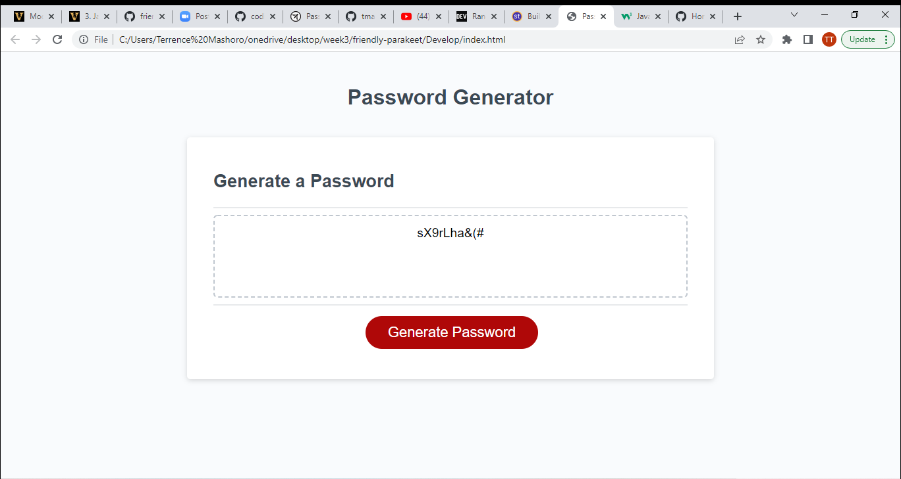

# Password Generator 

## Description
The application generates a random password based on user input. The user can choose between 4 different distinctions which are lower case letter, upper case letter, number and special character. When the password is generated, it will display on the page.

### Screenshot

#### Link
